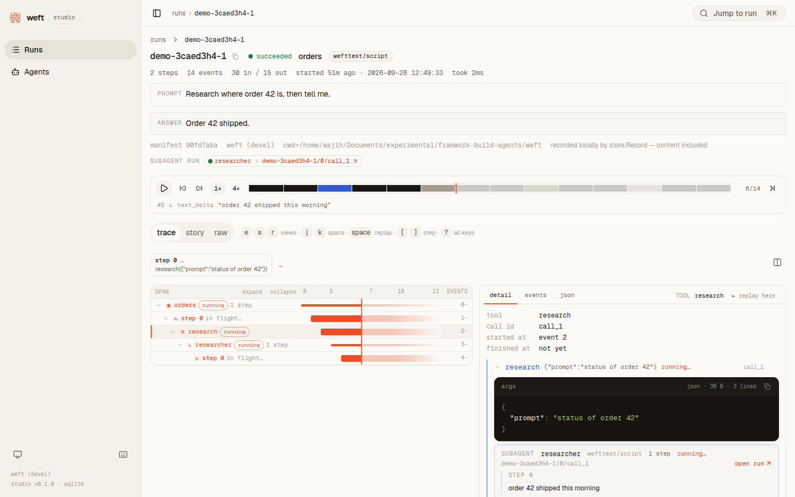
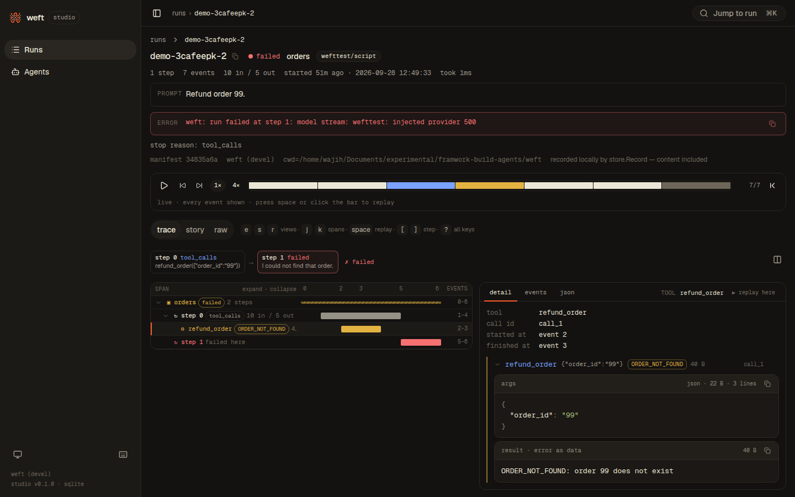
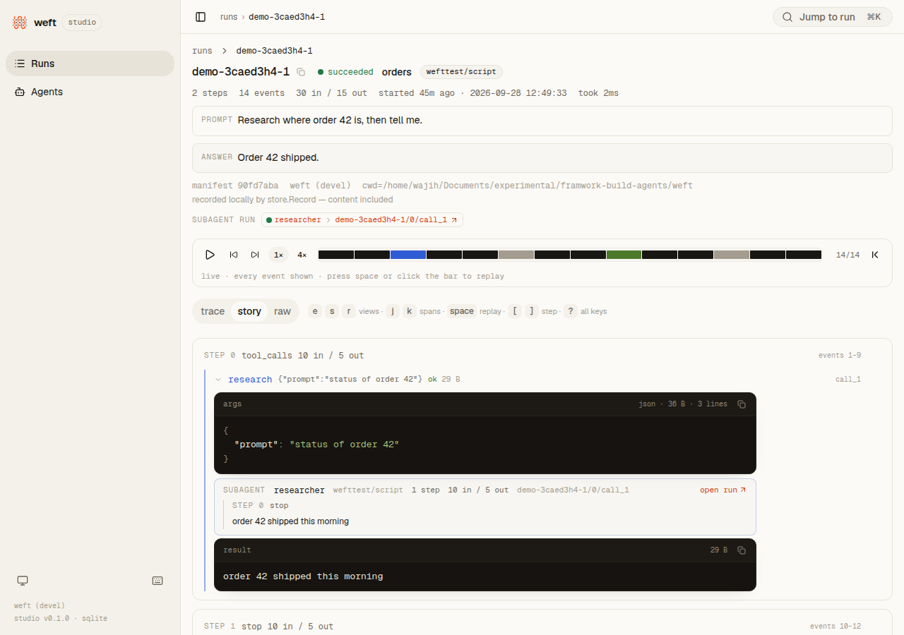
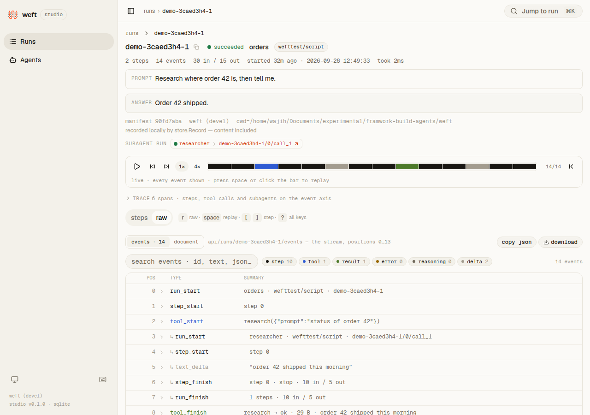
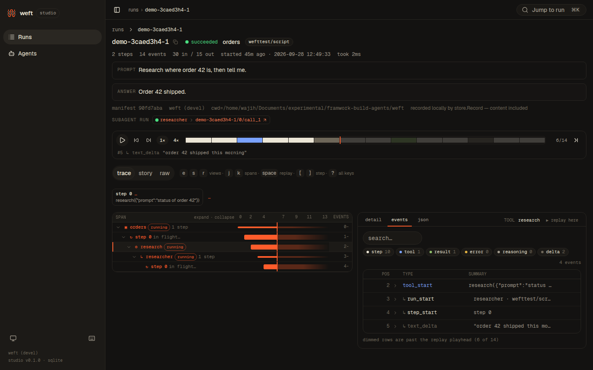
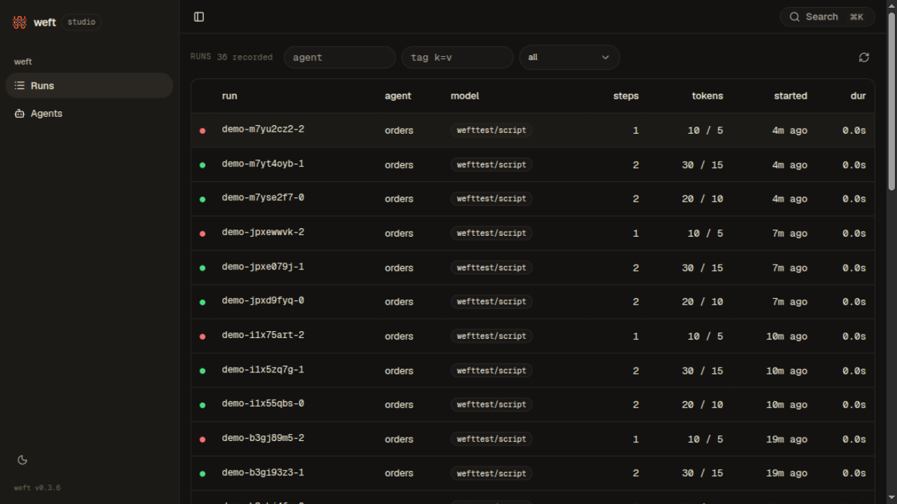

# weft studio — the Inspector

A read-only UI over a [run store](../store): the runs list, the run
page (steps, tool calls and results, subagents inline, truncation
badged), guaranteed replay over the event index, raw JSON, and agent
and tool cards from the manifest. One `http.Handler`, no build step
for users, fully offline.

## Use it

```go
mux.Handle("/studio/", http.StripPrefix("/studio",
    studio.Handler(myStore, studio.Manifest(manifestBytes)))
```

Then record runs with `store.Record` (see
[examples/basic](./examples/basic)) and open
`http://127.0.0.1:7331/studio/`. Try the example end to end:

```sh
go run ./studio/examples/basic        # records three demo runs, serves :7331
go run ./studio/examples/basic -serve # serve an existing database only
```

The runs list (light): status as a dot and a word, the error under a
failed run's id, filters that mirror the URL, the whole row opens the
run:


The run page (light) — the prompt and the answer first, then the
facts and the replay bar; below, the **trace**: the flow strip (one
pill per step, arrows for results fed back), then the waterfall on
the left — the run, its steps, tool calls and subagent runs (their
own steps and calls nested) as spans on one axis — and the selected
span's data on the right, read as *detail* (the same step and call
bodies as the story), *events* (only that span's slice of the
stream) or *json* (the folded node). The trace opens on whatever
went wrong, else the first step; `j`/`k` or the arrow keys walk it;
`?sel=` names the selection. The split appears when the content is
about 768px wide (collapse the sidebar on a small screen), and the
toggle beside the flow strip forces side by side or stacked:


The axis is the event position: events carry no timestamps, so this
is order, not duration (T2a's spans put time on the same component).
Scrubbed to event 6 of 14, the replay playhead crosses every row,
everything past it is veiled, and the detail panel renders the fold
*at* the playhead — the call reads `running` until its finish is
revealed:



A failed run (dark): the error at the top, the flow strip's step 1
red, the `ORDER_NOT_FOUND` tool error as data (mustard, never red)
selected first, and the step that had no `step_finish` saying so:



The story view (`s`) is the step cards top to bottom, the same
bodies as the detail panel:



Raw (light) — the events explorer: every event by position with its
kind, type and a one-line summary, filtered by kind, searched by any
JSON text, opened to the full event, and sent to the replay playhead
with one click. The `document` surface is the run document as a
collapsible tree; both copy and download whole:



Replay (dark), scrubbed to event 6 of 14 — the readout names the
event at the playhead, the steps show exactly the folded prefix, and
a call without its finish yet reads *running…*:



Dark and light follow the system; the sidebar footer's toggle (or the
palette) cycles system → light → dark:



Every view is a URL: filters, `view=story|raw` (and `raw=doc`), the
selected span `sel` and detail mode `d`, the selected step, and the
replay position `t` all live in search params — paste a link into an
issue and it reproduces exactly. Keyboard: `⌘K` jumps to any recent
run, `/` filters, `j`/`k` move (rows in the list, spans in the
trace), `enter` opens, `e`/`s`/`r` switch trace/story/raw, `space`
replays, `[`/`]` jump by step or tool event, `,`/`.` move one event,
`?` lists everything, `g r`/`g a` navigate.
Keys fire only on a bare press outside a text box — ctrl/⌘ always go
to the browser.

## The API (plan §3 of docs/phase2b-studio-plan.md)

Read-only JSON under `{base}api/`: `meta` (versions, capabilities),
`runs` (list, filtered, paged by cursor), `runs/{id}` (the run
document — never events), `runs/{id}/events?after=&limit=` (the paged
event stream; a live tail is the same endpoint read from the last
position), `manifest`. Capabilities are the hosting seam (ADR 0018
§8): the open handler reports none; a hosted server declares them
with `studio.Capabilities(…)`.

## Contributing to the UI

The web app lives in [web/](./web) — TanStack Start in SPA mode,
React, shadcn/ui on Tailwind v4, built with Bun. Users never need it:
the build output is committed at [dist/](./dist) and embedded with
`go:embed`.

```sh
make studio-build   # cd studio/web && bun install && bun run build
make studio-check   # rebuild, prove dist is fresh, check the 600 KiB gzip budget, typecheck + test
```

`make studio-check` is the freshness gate (ADR 0018 §4): it fails if
`dist/` does not match `web/` or if the gzipped total exceeds 600 KiB
(currently ~313 KiB). The build is deterministic — two builds from
one tree are byte-identical (`scripts/clean-dist.ts` pins the router's
prerender timestamp and keeps `<base href>` first in `<head>`).

The dev loop is two terminals: `go run ./studio/examples/basic
-serve` (API + embedded UI on :7331) and `cd studio/web && bun run
dev -- --base /studio/` (Vite on :3000 proxying `/studio/api`).

Go module: `github.com/weftgo/weft/studio`, requiring the tagged
`weft` and `weft/store` — standalone-importable, no `replace`.
